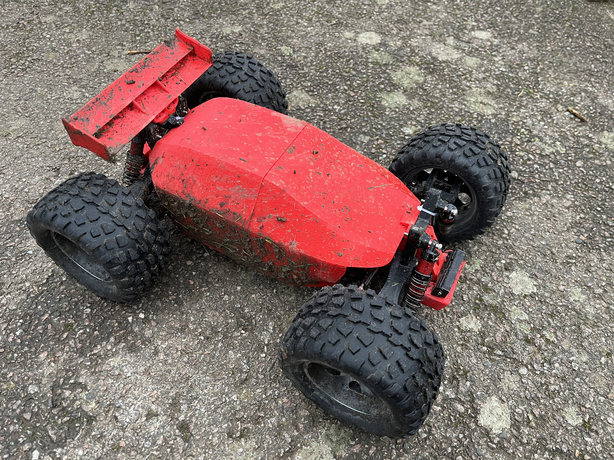

# Robak Unkillable Demon Edition

An open-source RC car that started out as a heavily modified version of [Robak v2.2](https://github.com/robaki-dev/robak/).

The most resilient RC car on the planet! More driving and less repairing. This car only stops when your battery is empty. If you break this car after flying out of your apartment window I failed.

Select your own hardware with the BOM as your guide. All plastic parts can be 3D printed.

### 19-10-2024 v1.1 RELEASE
V1.1 is now included in the STEP files. It has superior performance/handling due to lower center of mass. Shocks can travel a bit further, hopefully resulting in softer body slams after high jumps. It is also more rigid which makes the drivetrain less prone to damage due to acrobatics. See BOM/Printing for more info to upgrade from v1.0.

[Printing instructions](docs/printing.md)

[Bill Of Materials](docs/BOM.md)

[Assembly](docs/Assembly.md)

### FAQ: What is this car going to cost me?

Complete kit without plastic parts: Low budget: €200. Premium: €400. The BOM lists all premium parts.