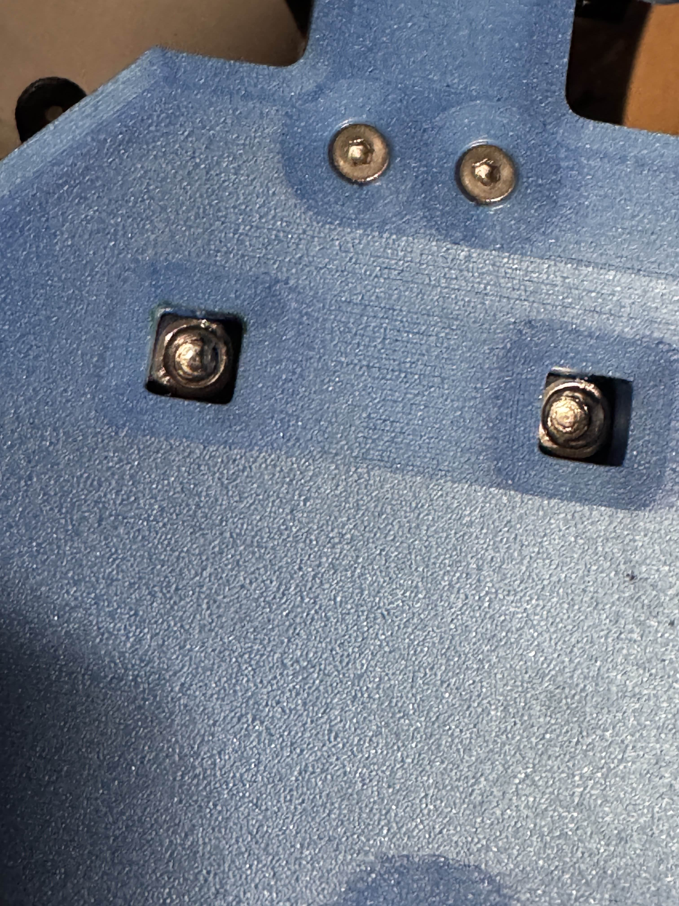
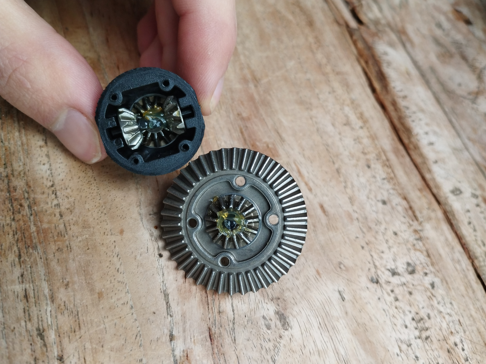
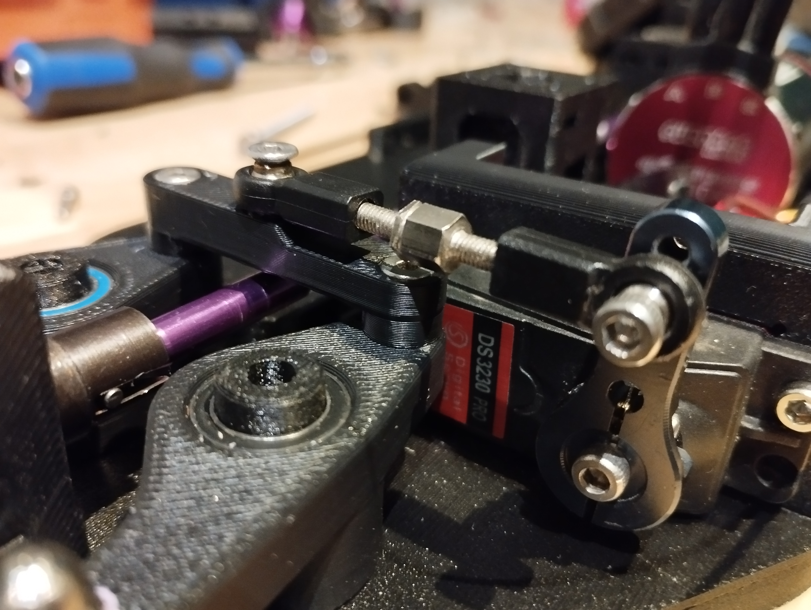
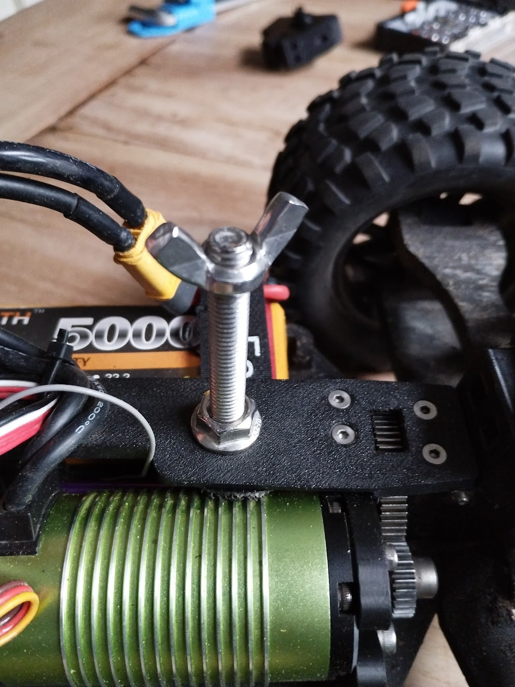

# Assembly

For an upgrade from v1.0 to v1.1 the chassis, bellcranks and motorplate must be replaced. (Body can be saved for last.)

At least loctite all grub screws + bolts going in the HSP steering links. Arms should be able to move freely, don't tighten the M3 bolts that function as joints.

Install 350mm ⌀5mm steel rods through the two ⌀5mm holes in the sides of the chassis AFTER the two M5x30 bolts through the bellcranks and topdeck are inserted!

Use M5 square nuts in the bottom slots. The bell cranks from v1.1 only need one 10x15x4 bearing instead of two.

To make sure your diffs last as long as possible fill the inside ~80% with diff oil [50k-100k Cst, preferably close to 80K]. Image below shows how it looks from factory (full of air, which is bad):

Also fill up the housing with grease, keep rotating until almost no grease wants to go in anymore, this will make your gears last as long as possible. Make sure that they feel right (some resistance is fine, but there should be no side-to-side play), a slight shrinkage of 0.2mm will make it way less reliable, read #troubleshooting in discord for more info.

The steering link should be installed as follows (you may want to use the top hole on servo horn):

The bearing in motorplate should be locked with a M3 washer + bolt (4mm). This way its possible to drive RUDE with RWD. The main reason for this feature is to protect your differential from damage when the middle axis escapes.

You need to drill a 8mm hole in the rear of the body, to fasten the body with a wing nut to the M8x60mm bolt that is coming out of TopDeckR.

Tires need to be glued to the rims, this needs to be waterproof so there is no water/dirt going inside the wheels, making your car harder to control. Power glue may suffice for plastic rims. ZAP-RT for metal.

For the rest assembly is pretty similar to [this video](https://www.youtube.com/watch?v=374VbFoaV5E).
Note: two M5x30 bolts are used for stiff steering. There are two big square holes in the bottom of the chassis for M5 square nuts. They should be installed before the two 350mm rods!